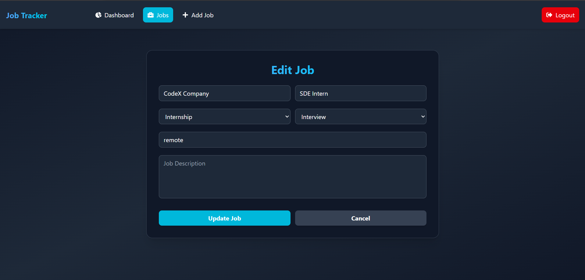

# Project Screenshots

## Login

  
The login page where users can sign in with their credentials.

---

## Register

  
The registration page for creating a new account.

---

## Dashboard

  
The main dashboard that shows an overview after login.

---

## Job Filter

  
A page where users can filter jobs based on different criteria.

---

## Edit Job (Home View)

  
Inline job editing directly from the home job list.

---

## Edit Job Page

  
Detailed job editing page for updating job information.

---

## Delete Job

  
Confirmation popup for deleting a job entry.

---

## Add New Job

  
Form for adding a brand new job entry into the system.
